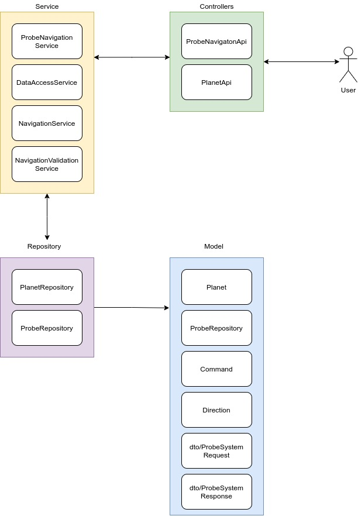

# ProbeSystem
## Sistema de navegação de Sondas espaciais

### Descrição

A descrição do problem se encontra neste [link](https://gist.github.com/elo7-developer/1a40c96a5d062b69f02c)

### Premissas

- Foi assumido uma entrada em json com um schema próprio que pode ser visto no swagger abaixo.
- Quando uma sonda pousar num planeta e se movimentar, caso um movimento a frente (Comando M) faça ela sair dos limites do planeta, ela nunca vai ultrapassar esse limite e sua posição sempre vai ser a borda do planeta.
- Foi utilizado um banco em memória (H2) como camada de persistência.
- Um probe só consegue navegar num planeta cadastrado/já existente.
- Atualmente o sistema não suporta checagem de colisões entre as sondas.

### Documentação

#### Swagger

O swagger contendo informação sobre os endpoints e schema se encontra mapeado na URL: [Swagger](http://localhost:8080/swagger-ui/index.html?configUrl=/v3/api-docs/swagger-config). 
Você pode ver exemplos de requisições no arquivo [Requisições.txt](./docs/Requisições.txt)
#### Modelagem do Sistema

O sistema foi modelado da seguinte forma

**Controllers**
- ProbeNavigationApi: API que contém endpoints com funcionalidades mapeadas ao objeto Probe e sua navegação num planeta **já cadastrado**.
- PlanetApi: API que contém endpoints com funcionalidades mapeadas ao objeto Planet.

**Services**
- ProbeNavigationService: serviço que recebe o ProbeSystemRequest e partir dele interage com os outros serviços.
- DataAccessService: serviço de acesso à persistência.
- NavigationService: serviço que contém funcionalidades relacionadas a navegação de um probe num planeta.
- NavigationValidationService: serviço que contém validações e regras do que é um probe valido, um planeta válido e uma interação válida entre esses dois objetos.

**Repository**
- PlanetRepository: repositório utilizado para armazenar os objetos/entity Planet
- ProbeRepository: repositório utilizado para armazenar os objetos/entity Probe.

**Models**
- Planet: objeto @Entity representa o objeto Planeta no nosso sistema.
- Probe: objeto @Probe que representa o objeto Probe no nosso sistema.
- Command: Enum que contém os comandos disponíveis
- Direction: Enum que contém as direções disponíveis.

**Models/DTO**
- ProbeSystemRequest: objeto intermediario que encapsula outros objetos e serve de entrada.
- ProbeSystemResponse: objeto intermediario que encapsula outros objetos e serve de saida.
- 
##### Diagrama do Sistema

